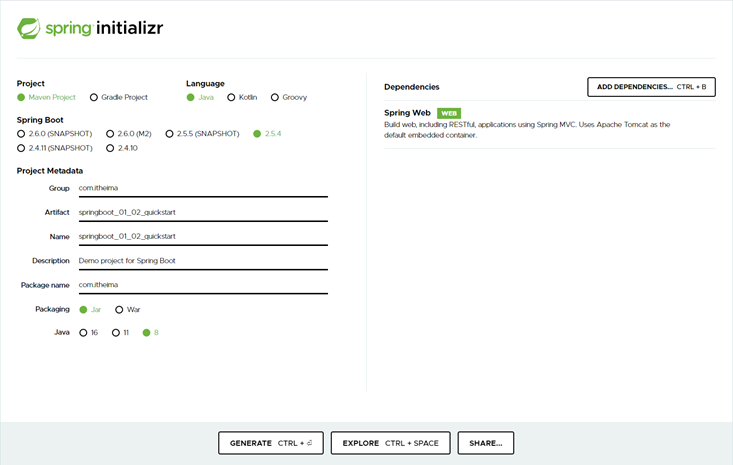

# SpringBoot基础篇

在基础篇中，能够使用SpringBoot搭建基于SpringBoot的web项目开发，所以内容较少，主要包含如下内容：

- SpringBoot快速入门
- SpringBoot基础配置
- 基于SpringBoot整合SSMP

# SpringBoot快速入门

**均是先创建空的工程啊！1下面创建的都是说的模块。**

Springboot带来的最大便利如下：

- 起步依赖（简化依赖配置）
  - 依赖配置的书写简化就是靠这个起步依赖达成的
- 自动配置（简化常用工程相关配置）
  - 配置过于繁琐，使用自动配置就可以做响应的简化，但是内部还是很复杂的，后面具体展开说
- 辅助功能（内置服务器，……）
  - 除了上面的功能，其实SpringBoot程序还有其他的一些优势，比如我们没有配置Tomcat服务器，但是能正常运行，这是SpringBoot程序的一个可以感知到的功能，也是SpringBoot的辅助功能之一。一个辅助功能都能做的这么6，太牛了

​	这些简化操作具体都在哪些方面进行体现的，一共分为4个方面，这里不再写，看视频理解就行了。

- parent
- starter
- 引导类
- 内嵌tomcat

## 1.springboot项目创建（idea联网版）

**步骤①**：创建新模块，选择Spring Initializr，并配置模块相关基础信息


<font color="#ff0000"><b>特别关注</b></font>：第3步点击Next时，Idea需要联网状态才可以进入到后面那一页，如果不能正常联网，就无法正确到达右面那个设置页了，会一直<font color="#ff0000"><b>联网</b></font>转转转

​	<font color="#ff0000"><b>特别关注</b></font>：第5步选择java版本和你计算机上安装的JDK版本匹配即可，但是最低要求为JDK8或以上版本，推荐使用8或11

**步骤②**：选择当前模块需要使用的技术集


按照要求，左侧选择web，然后在中间选择Spring Web即可，选完右侧就出现了新的内容项，这就表示勾选成功了

<font color="#ff0000"><b>关注</b></font>：此处选择的SpringBoot的版本使用默认的就可以了，需要说一点，SpringBoot的版本升级速度很快，可能昨天创建工程的时候默认版本是2.5.4，今天再创建工程默认版本就变成2.5.5了，差别不大，无需过于纠结，回头可以到配置文件中修改对应的版本

**步骤③**：开发控制器类

```java
//Rest模式
@RestController
@RequestMapping("/books")
public class BookController {
    @GetMapping
    public String getById(){
        System.out.println("springboot is running...");
        return "springboot is running...";
    }
}
```

入门案例制作的SpringMVC的控制器基于Rest风格开发，当然此处使用原始格式制作SpringMVC的程序也是没有问题的，上例中的**@RestController**与**@GetMapping注解**是基于Restful开发的典型注解

**步骤④**：运行自动生成的Application类


```
访问路径：	http://localhost:8080/books
```

现在就可以通过浏览器访问请求的路径，测试功能是否工作正常了

## 2.springboot项目创建（官网版）

SpringBoot官网和Spring的官网是在一起的，都是  spring.io  。你可以通过项目一级一级的找到SpringBoot技术的介绍页，然后在页面中间部位找到如下内容


**步骤①**：点击Spring Initializr后进入到创建SpringBoot程序的界面上，下面是输入信息的过程，和前面的一样，只是界面变了而已，根据自己的要求，在左侧选择对应信息和输入对应的信息即可



**步骤②**：右侧的ADD DEPENDENCIES用于选择使用何种技术，和之前勾选的Spring WEB是在做同一件事，仅仅是界面不同而已，点击后打开网页版的技术选择界面


**步骤③**：所有信息设置完毕后，点击下面左侧按钮，生成一个文件包

**步骤④**：保存后得到一个压缩文件，这个文件打开后就是创建的SpringBoot工程文件夹了

**步骤⑤**：解压缩此文件后，得到工程目录，在Idea中导入即可使用，和之前创建的东西完全一样。下面就可以自己创建一个Controller测试一下是否能用了。

<font color="#f0f"><b>温馨提示</b></font>

​	做到这里其实可以透漏一个小秘密，Idea工具中创建SpringBoot工程其实连接的就是SpringBoot的官网，走的就是这个过程，只不过Idea把界面给整合了一下，读取到了Spring官网给的信息，然后展示到了Idea的界面中而已。


## 3.springboot项目创建（阿里云版）

前面都是基于国外的官网，有的时候网速很慢，不太行。

创建工程时，切换选择starter服务路径，然后手工收入阿里云提供给我们的使用地址即可。地址：http://start.aliyun.com


阿里为了便于自己开发使用，因此在依赖坐标中添加了一些阿里相关的技术，也是为了推广自己的技术吧，所以在依赖选择列表中，你有了更多的选择。不过有一点需要说清楚，阿里云地址默认创建的SpringBoot工程版本是<font color="#ff0000"><b>2.4.1</b></font>，所以如果你想更换其他的版本，创建项目后手工修改即可，别忘了刷新一下，加载新版本信息


阿里云提供的地址更符合国内开发者的使用习惯，里面有一些SpringBoot官网上没有给出的坐标。

​	<font color="#ff0000"><b>注意</b></font>：阿里云提供的工程创建地址初始化完毕后和实用SpringBoot官网创建出来的工程略有区别。主要是在配置文件的形式上有区别。

## 教你一招：在Idea中隐藏指定文件/文件夹

创建SpringBoot工程时，使用SpringBoot向导也好，阿里云也罢，其实都是为了一个目的，得到一个标准的SpringBoot工程文件结构。这个时候就有新的问题出现了，标准的工程结构中包含了一些未知的文件夹，在开发的时候看起来特别别扭，这一节就来说说这些文件怎么处理。

​	处理方案无外乎两种，如果你对每一个文件/目录足够了解，没有用的完全可以删除掉，或者不删除，但是看着别扭，就设置文件为看不到就行了。删除不说了，直接Delete掉就好了，这一节说说如何隐藏指定的文件或文件夹信息。

​	既然是在Idea下做隐藏功能，肯定隶属于Idea的设置，设置方式如下。

**步骤①**：打开设置，【Files】→【Settings】


**步骤②**：打开文件类型设置界面，【Editor】→【File Types】→【Ignored Files and Folders】，忽略文件或文件夹显示


**步骤③**：添加你要隐藏的文件名称或文件夹名称，可以使用*号通配符，表示任意，设置完毕即可

## 补充：REST风格

### 简介

- <font color="#ff0000"><b>REST</b></font>：（Representational State Transfer），表现形式状态转换。一种资源表现风格


优点：

- 隐藏资源的访问行为，无法通过地址得知对资源是何种操作。
- 书写简化

**这样就有一个问题**：我怎么知道它具体是做的什么操作呢，我查询指定用户用的是上面那个user/1的路径，那我删除呢，修改呢，于是这个公司建立了下面这种，加了一个行为动作。


<font color="#ff0000"><b>RESTful</b></font>：后来我们统一把上面几个根据REST风格对资源进行访问的方式叫做RESTful

<font color="#ff0000"><b>注意事项：</b></font>

​		上述的行为是约定方式，约定不是规范，是可以被打破的，不一定要按照这样写，所以说叫做REST风格，不是REST规范。但随着人数越来越多，逐渐成为了一种专业的约定。


# SpringBoot基础配置

## 1.属性配置

application.properties就是springboot的配置文件，所有相关的配置都是在这里修改！

properties格式的文件书写规范是key=value，

- **修改服务器端口**

  默认tomcat的是8080，我们改成80。直接打开配置文件，写入：

  ```properties
  server.port=80
  ```

  搞定

- **关闭,修改运行日志图表（banner)**

  ```properties
  spring.main.banner-mode=off
  spring.banner.image.location=text.png
  ```

- **设置运行日志的显示级别**

  ```properties
  logging.level.root=debug
  ```

  还有特别多的配置可以修改，具体在官方文档里面查询就行了。

  打开SpringBoot的官网，找到SpringBoot官方文档，打开查看附录中的Application Properties就可以获取到对应的配置项了，

能写什么的问题解决了，再来说第二个问题，这个配置项和什么有关。在pom中注释掉导入的**spring-boot-starter-web**，然后刷新工程，你会发现配置的提示消失了。其实是设定使用了什么技术才能做什么配置。也合理，不然配置的东西都没有使用对应技术，配了也是白配。

<font color="#f0f"><b>温馨提示</b></font>

​	所有的starter中都会依赖下面这个starter，叫做**spring-boot-starter**。这个starter是所有的SpringBoot的starter的基础依赖，里面定义了SpringBoot相关的基础配置，关于这个starter我们到开发应用篇和原理篇中再深入讲解。

```properties
<dependency>
    <groupId>org.springframework.boot</groupId>
    <artifactId>spring-boot-starter</artifactId>
    <version>2.5.4</version>
    <scope>compile</scope>
</dependency>
```

## 2.配置文件分类

- properties格式

  ```properties
  server.port=80
  ```

- **yml格式（常用）**

  ```yml
  server:
    port: 81
  ```

- yaml格式

  ```yaml
  server:
    port: 82
  ```

yml和yaml文件格式就是一模一样的，只是文件后缀不同，所以可以合并成一种格式来看.

**三种配置文件的优先级：**

1. 配置文件间的加载优先级	properties（最高）>  yml  >  yaml（最低）
2. 不同配置文件中相同配置按照加载优先级相互覆盖，不同配置文件中不同配置全部保留

## 教你一招：**自动提示功能消失解决方案**

有的时候，我们新建或者删除了配置问价之后，发现配置的代码自动提示消失了。

大体原因有如下2种：

1. Idea认为你现在写配置的文件不是个配置文件，所以拒绝给你提供提示功能
2. Idea认定你是合理的配置文件，但是Idea加载不到对应的提示信息

这里我们主要解决第一个现象，第二种现象到原理篇再讲解。第一种现象的解决方式如下：

**步骤①**：打开设置，【Files】→【Project Structure...】


**步骤②**：在弹出窗口中左侧选择【Facets】，右侧选中Spring路径下对应的模块名称，也就是你自动提示功能消失的那个模块


**步骤③**：点击Customize Spring Boot按钮，此时可以看到当前模块对应的配置文件是哪些了。如果没有你想要称为配置文件的文件格式，就有可能无法弹出提示


**步骤④**：选择添加配置文件，然后选中要作为配置文件的具体文件就OK了


## 3.yml文件格式

yml具有严格的语法格式要求，具体如下：

1. 大小写敏感
2. 属性层级关系使用多行描述，**每行结尾使用冒号结束**
3. 使用缩进表示层级关系，同层级左侧对齐，只允许使用空格（**不允许使用Tab键**）
4. 属性值前面添加空格（属性名与属性值之间使用冒号+空格作为分隔）

5. "  #  "号表示注释
6. 使用**引号包裹的字符串**，里面的转义字符可以生效，其他情况不生效

下面列出常见的数据书写格式，熟悉一下.

```yml
boolean: TRUE  						#TRUE,true,True,FALSE,false，False均可
float: 3.14    						#6.8523015e+5  #支持科学计数法
int: 123       						#0b1010_0111_0100_1010_1110    #支持二进制、八进制、十六进制
null: ~        						#使用~表示null
string: HelloWorld      			#字符串可以直接书写
string2: "Hello World"  			#可以使用双引号包裹特殊字符
date: 2018-02-17        			#日期必须使用yyyy-MM-dd格式
datetime: 2018-02-17T15:02:31+08:00  #时间和日期之间使用T连接，最后使用+代表时区
```

​	此外，yaml格式中也可以表示**数组**，在属性名书写位置的下方**使用减号**作为数据开始符号.

```yml
subject:
	- Java
	- 前端
	- 大数据
enterprise:
	name: itcast
    age: 16
    subject:
    	- Java
        - 前端
        - 大数据
likes: [王者荣耀,刺激战场]			#数组书写缩略格式

users:							         #对象数组格式
  - name: Tom
   	age: 4
  - name: Jerry
    age: 5
users2: [ { name:Tom , age:4 } , { name:Jerry , age:5 } ]	#对象数组缩略格式
```

## 4.yml数据读取

对于yaml文件中的数据，其实你就可以想象成这就是一个**小型的数据库**，里面保存有若干数据，每个数据都有一个独立的名字.

### 读取单一数据

yaml中保存的单个数据，可以使用Spring中的注解直接读取，使用@Value可以读取单个数据，属性名引用方式：<font color="#ff0000"><b>${一级属性名.二级属性名……}</b></font>


记得使用**@Value注解**时，要将该注入写在某一个指定的Spring管控的bean的属性名上方。现在就可以读取到对应的单一数据行了

```yml
baseDir: c:\win10
temDir: ${baseDir}\temp
```


### 读取全部数据

SpringBoot提供了一个对象，能够把所有的数据都封装到这一个对象中，这个对象叫做**Environment**，使用**自动装配注解@Autowired**可以将所有的yaml数据封装到这个对象中


数据封装到了Environment对象中，获取属性时，通过Environment的接口操作进行，具体方法是**getProperties（String）**，参数填写属性名即可

### 读取对象数据

单一数据读取书写比较繁琐，全数据封装又封装的太厉害了，每次拿数据还要一个一个的getProperties（）,总之用起来都不是很舒服。由于Java是一个面向对象的语言，很多情况下，我们会将一组数据封装成一个对象。SpringBoot也提供了可以将一组yaml对象数据封装一个Java对象的操作。

首先要定义一个类，这个类是用来装yml的数据的，并将该对象纳入Spring管控的范围，也就是**定义成一个bean**，然后使用注解**@ConfigurationProperties**指定该对象加载哪一组yaml中配置的信息。

**@Component**——将该类定义成一个bean。


这个@ConfigurationProperties必须告诉他加载的**数据前缀**是什么，这样当前前缀下的所有属性就封装到这个对象中。记得**数据属性名要与对象的变量名一一对应**啊，不然没法封装。其实以后如果你要定义一组数据自己使用，就可以先写一个对象，然后定义好属性，下面到配置中根据这个格式书写即可。


### yaml文件中的数据引用

如果你在书写yaml数据时，经常出现如下现象，比如很多个文件都具有相同的目录前缀

```yml
center:
	dataDir: /usr/local/fire/data
    tmpDir: /usr/local/fire/tmp
    logDir: /usr/local/fire/log
    msgDir: /usr/local/fire/msgDir
```

或者

```yml
center:
	dataDir: D:/usr/local/fire/data
    tmpDir: D:/usr/local/fire/tmp
    logDir: D:/usr/local/fire/log
    msgDir: D:/usr/local/fire/msgDir
```

这个时候你可以使用**引用格式**来定义数据，其实就是搞了个变量名，然后引用变量了，格式如下：

```yml
baseDir: /usr/local/fire
	center:
    dataDir: ${baseDir}/data
    tmpDir: ${baseDir}/tmp
    logDir: ${baseDir}/log
    msgDir: ${baseDir}/msgDir
```

​	还有一个注意事项，在书写字符串时，如果需要使用**转义字符**，需要将数据字符串使用**双引号**包裹起来

```yml
lesson: "Spring\tboot\nlesson"
```

